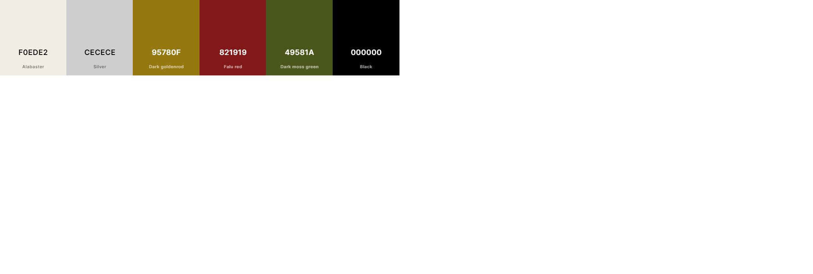
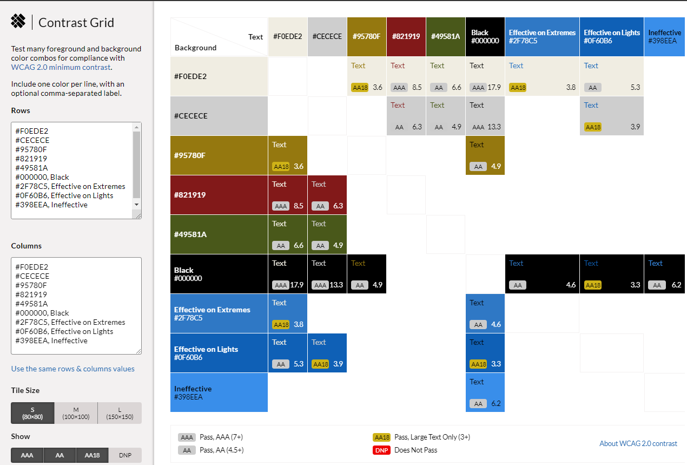
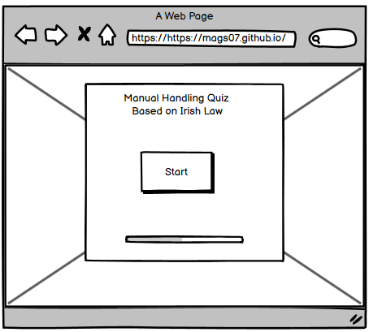
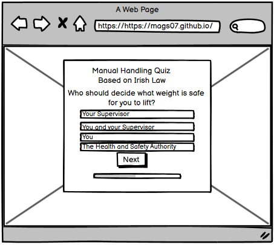
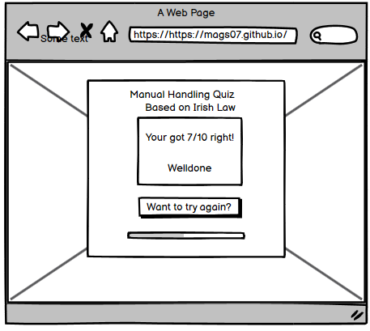
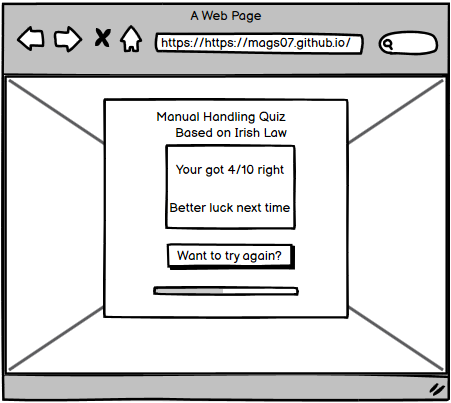

# Sauna Beach Spa

Manual Handling Quiz is useful for people who may want to refresh abit of their training. Employers may send this out to their staff to do a quick review if anyone should re-do their training soon. In Ireland employers are legaly bound to facilitating Manual Handling training within all types of work settings. But some people may need re-freshers sooner.

This quiz is based on the Irish Health and Safety Authority.

**Link to** [live site](https://mags07.github.io/Manual_Handling_Quiz/)

Full website designed myself: [Margarita Buyukli](https://www.linkedin.com/in/margarita-buyukli/)

## Contents
- [**Business Goals**](#business-goals)
  - [**Scope**](#scope)
  - [**Specifications**](#specifications)

- [**User Experience**](#user-experience)
  - [**User Stories**](#user-stories)
  - [**Responsive Web Design**](#responsive-web-design)

- [**Design**](#design)
  - [**Mockup**](#mockup)
  - [**Imagery**](#imagery)
  - [**Typography**](#typography)

- [**Technologies**](#technologies)
  - [**Languages**](#languages)
  - [**Libraries**](#libraries)
  - [**Other Tools**](#other-tools)

- [**Testing**](#testing)

- [**Deployment**](#deployment)

- [**Credits**](#credits)
  - [**Articles**](#articles)
  - [**Acknowledgements**](#acknowledgements)

## Business Goals

### Scope
1 page
- 10 questions
- Questions to apear one by one, in random order.
- Some questions included are quite straight forward, while other are harder.
- This page is for users to learn about their knowledge on this topic.

### Specifications

- __Aspects of a website to include__
- This quiz is not an offical HSA quiz, therefore it is just to help people to test their knowledge. Perhaps for a little entartaiment.
- The colours should be bold to attract users. For example the background photo is from https://unsplash.com/photos/Rbs7VW98G9A )
-The questions will vary between easy and hard.
- Mouse hovering reactions to make it more user friendly.
- As manual Handling is not the most entertaining topic, the quiz contains 10 questions. So it doenst take too long. Avoiding people not completing the quiz.

## User Experince

### First Time Visitor Goals

  - To imediatelly understand what is the main purpose of this website.
  - To be user friendly by simplifying the prosses people need to go through to do this quiz.
  - To make it look enterntaining, when the topic it's self may not be to alot of people.
  - To make sure the website is responsive on whatever devise the visitor is on.

### Returning Visitor Goals

  - Be able to find the website again easily with the use of SEO keywords.
  - If the employer is sharing this website, they want to make sure everyone will be able to navigate through it easily. Even people who lack technological skills or have low level of english.
  - To be able to access this quiz on any screen size device.

## Design

### Colour Scheme
Colour Scheme chosen from [Coolors](https://coolors.co/)

Visual colour accessability analitics
[Contrast Grid Eightshapes](https://contrast-grid.eightshapes.com/)

### Typography

- [Google Fonts](https://fonts.google.com/)

  - Used 'Raleway' font for all the text, to make it look less official, and more fun.

### Image

Image from [Unsplash](https://unsplash.com/photos/Rbs7VW98G9A)

### Favicon
LogFavicon icon from [Favicon](https://favicon.io/favicon-generator/)

### Wireframes
- Wireframes were created using [Balsamiq](https://balsamiq.com/)

### Features
10 questions - not too long and not too short, as the topic is not the most entartaining for most people.
Imagery - colourful, to keep the user's attention
Buttons - for ease of navigation through the website

- Future Features
Adding more questions to the mix, while leaving the test at 10 questions.
Allowing people to register to save their score.
Adding an invitation through email for employers to invite employees to take this quiz.

[Back to contents](#contents)

## Technologies

- Box Shadow Generator [CSSmatic](https://www.cssmatic.com/box-shadow/)

### Languages

- [HTML5](https://www.w3schools.com/html/default.asp/)

  - Used for the creation of the website content.

- [CSS3](https://www.w3schools.com/Css/default.asp/)

  - Cascading Style Sheets language used to style individual pages.

- [JavaScript](https://www.w3schools.com/js/default.asp/)
- JaveScript was used to program the behaviour of the quiz.

[Back to contents](#contents)

### Libraries & Other Tools

- 
  - helps with

- [Grid Layout It](https://grid.layoutit.com/)

- [GitHub](https://github.com/)

  - Hosting service for software development.

- [FontAwesome](https://fontawesome.com/)

  - Icon library and toolkit.

- [Lighthouse](https://developer.chrome.com/docs/lighthouse/overview/)

  - Audit the site for performance, quality, best practices and SEO.

- [Microsoft Edge DevTools](https://developer.microsoft.com/en-us/microsoft-edge/tools/)

 - Was used to test the code and debug the code during the development process.

- [AmIResponsive](https://ui.dev/amiresponsive/)

  - An online tool to check how responsive the website is on different screen sizes. Screenshot of this is provided in the begining of README.

- [Markup Validation Service](https://validator.w3.org/)

  - Validator checks the markup validity of Web documents in HTML.

- [CSS Validation Service](https://jigsaw.w3.org/css-validator/)

  - Online tool validates CSS.

- [JavaScript Hint](https://jshint.com/)

  - Online tool to validate JavaScript

[Back to contents](#contents)

## Testing

For testing the DevTools have been used. But alot has not been solved.

## Deployment

The site was deployed to GitHub pages: [Github](https://github.com/)
The steps to deploy are as follows:
In the GitHub repository, navigate to the Settings tab.
From the left hand menu select 'Pages'
From the source select Branch: main
Click 'Save'
A live link will be displayed when published successfully. It may take about 5 minutes.
The live link can be found here: https://mags07.github.io/Sauna-Beach-Spa/index.html

[Back to contents](#contents)

## Credits
- [Youtube Web Dev Simplified](https://www.youtube.com/watch?v=riDzcEQbX6k/)

### Articles
- [Sitepoint JavaScript Quiz](https://www.sitepoint.com/simple-javascript-quiz/)
- [Geeks for geeks](https://www.geeksforgeeks.org/how-to-create-a-simple-javascript-quiz/)
- 

### Acknowledgements

- My mentor Elaine Roche.
- [Stackoverflow](https://stackoverflow.com/) community that have answered alot of similar questions I had.
- Google search engine for the overload of information on website development.

### Content 
- The text for the Home page was taken from; [Test questions](https://www.test-questions.com/manual-handling-test-01.php/). But as I am a certified Manual Handling instructor I was able to confirm that the questions from UK would still apply in our Irish setting.

[Back to contents](#contents)
